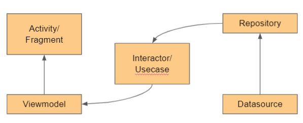
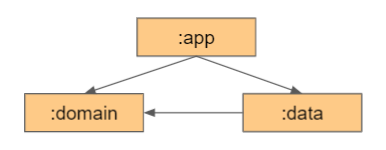

## JagaJalanBangkit
### #GoogleBangkit2021

The app helps you to capture damaged road and report it to the Public Works and Housing Ministry (PUPR).
Using ML, the picture you sent is going to be processed on the cloud server and returned to you with rectangles within it (as long as a damaged road detected).
With all that said, only valid reports are going to be shown to the officer.

### The Android App
Using **Architecture Components**, the app is built to be (slightly) easy built, maintain, and scaled up.

#### Layered Modularization

